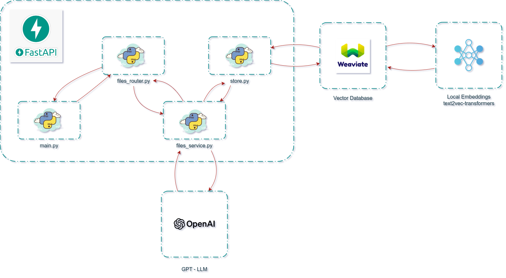

# BCGX Challenger

### The Mission

#### **Phase 1:**
- [X] Upload files
  - [X] Write I/O temporary file
  - [X] Read I/O memory file
  - [X] Write I/O file into database
- [X] Extract text
- [X] Generate embeddings
- [X] Store in a vector database
- [X] Retrieve similar phrases related to the question
#### **Phase 2:**
- [X] Rank text similarity to user questions
- [X] Create RAG prompts
- [ ] Clean text extract
- [ ] Create dataset question and answer
- [x] Validate params of LLM - GPT
- [x] Optimized context and prompt
#### **Phase 3:**
- [X] Create web app with streamlit
- [x] Initiate dialogue with the LLM
- [x] Consume API call on streamlit
#### **Phase 4:**
- [ ] Evaluate metrics for context and Q&A
- [ ] Optimize prompts using RAG metrics
- [x] Upload files with optimized prompts
- [ ] Human review of answers

---
### Run APP Web
1. install libraries: `pip install streamlit requests`
2. run: `streamlit run app.py`

### Run APP API
1. Clone the repository.
2. Navigate to the directory: `cd bcgx-challenger/api`
3. Install the required libraries: `pip install -r requirements.txt`
4. Run the application: `uvicorn main:app --reload`
5. configure the connection with postgres database `DATABASE_URL` into file bcgx-challenger/api/main.py - reflects the details of a remote database if it is not a localhost database.
6. Access the application at: [http://localhost:8000/docs](http://localhost:8000/docs)

---

### Run with Docker
1. Rename directory **api** duplicate the **.env.dev** file to **.env** and update the OPENAI_API_KEY with your own key openai.
2. run command: `docker-compose up --build`
3. Access the app **Web** at: [http://localhost:8501](http://localhost:8501/)
4. Access the app **API** at: [http://localhost:8000/docs](http://localhost:8000/docs)

### Tech and Frameworks
- **[Streamlit](https://streamlit.io/generative-ai)** - Frontend
- **[FastAPI](https://fastapi.tiangolo.com/)** - Backend
- **[Weaviate](https://weaviate.io/)** - Vector Database AI-native
- **[Embbeding](https://weaviate.io/developers/weaviate/model-providers/transformers/embeddings)** - Hugging Face Transformers
#### Weaviate's integration with the Hugging Face Transformers library 

---

### Arquitetura API

### BCG X Squad Five

|  |  |  |  |
|--------------------------------------------|------------------------------------------------------|------------------------------------------------------------|-------------------------------------------------------|
| [Hugo - Data Engineer](https://github.com/hucodelab) | [Joel Maykon - Data Scientist](https://github.com/joelmaykon94) | [Juliana Gonçalves - Data Scientist](https://github.com/jungoncalves) | [Mike Futorny - Software Engineer](https://github.com/MikeFutorny) |
