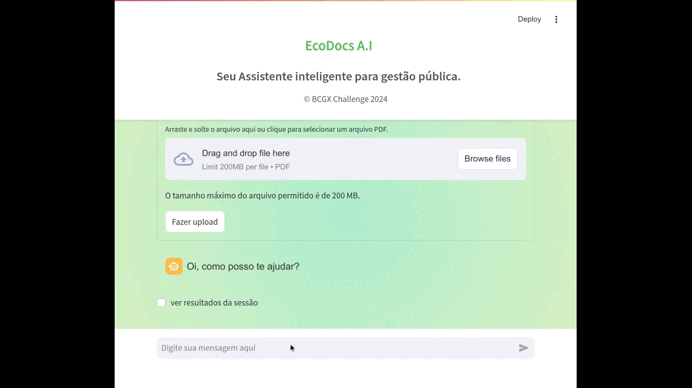
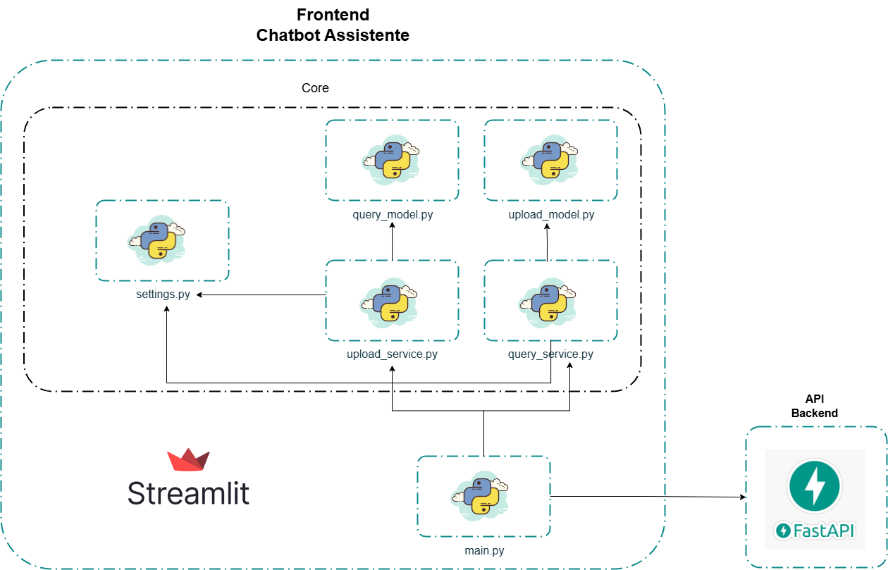

# BCGX Challenger

### The Mission

#### **Phase 1:**
- [X] Upload files
  - [X] Write I/O temporary file
  - [X] Read I/O memory file
  - [X] Write I/O file into database
- [X] Extract text
- [X] Generate embeddings
- [X] Store in a vector database
- [X] Retrieve similar phrases related to the question
#### **Phase 2:**
- [X] Rank text similarity to user questions
- [X] Create RAG prompts
- [X] Clean text extract
- [x] Validate params of LLM - GPT
- [x] Optimized context and prompt
#### **Phase 3:**
- [X] Create web app with streamlit
- [x] Initiate dialogue with the LLM
- [x] Consume API call on streamlit
#### **Phase 4:**
- [x] Upload files with optimized prompts

---

### Run with Docker
**After clone this repository:**

1. Duplicate the .env.dev file into the root, api, and app directories, renaming it to .env. Then, add your OpenAI API key to the OPENAI_API_KEY field in the .env file located in the api directory.
2. run command: `docker-compose up --build`
3. Access the app **Web** at: [http://localhost:8501](http://localhost:8501/)
4. Access the app **API** at: [http://localhost:8000/docs](http://localhost:8000/docs)

### Tech and Frameworks
- **[Streamlit](https://streamlit.io/generative-ai)** - Frontend
- **[FastAPI](https://fastapi.tiangolo.com/)** - Backend
- **[Weaviate](https://weaviate.io/)** - Vector Database AI-native
- **[Embbeding](https://weaviate.io/developers/weaviate/model-providers/transformers/embeddings)** - Hugging Face Transformers
#### Weaviate's integration with the Hugging Face Transformers library 

---

### API Architecture

### Frontend Architecture

### BCG X Squad Five

|  |  |  |  |
|--------------------------------------------|------------------------------------------------------|------------------------------------------------------------|-------------------------------------------------------|
| [Hugo - Data Engineer](https://github.com/hucodelab) | [Joel Maykon - Data Scientist](https://github.com/joelmaykon94) | [Juliana Gonçalves - Data Scientist](https://github.com/jungoncalves) | [Mike Futorny - Software Engineer](https://github.com/MikeFutorny) |
